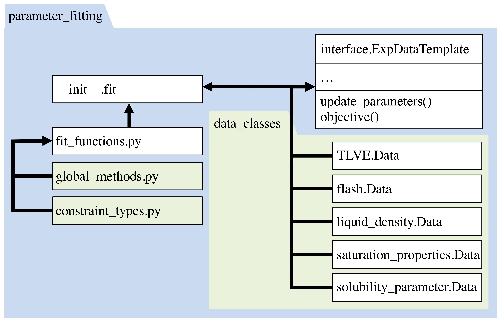

.. _contribute-fitting:

Parameter Fitting Features
=========================================================

The Parameter Fitting module has several options for a user to add a capability:

#. New experimental data classes may be added to the ``data_classes`` directory, as shown in Figure 1. This is recommended once a new thermodynamic calculation type is added to that module. However, the thermodynamic calculation types and the parameter fitting classes are not directly comparable, as some data classes cover multiple thermodynamic calculations. For example, the TLVE.Data class covers temperature dependent vapor liquid equilibria (TLVE) calculations such as the bubble point and dew point calculations. 
#. Global minimization algorithms are packaged in wrappers within the ``global_methods`` module. Adding a wrapper for a new method here allows the module to locate a breadth of methods from various sources. 
#. Another opportunity for growth at this level would be in the addition of a constraint function to the :mod:`~despasito.parameter_fitting.constraint_types` module. Constraint are optional additions to several supported global optimization algorithms (e.g. :func:`~despasito.parameter_fitting.global_methods.differential_evolution`) and so are defined in the ``global_dict`` input of :func:`~despasito.parameter_fitting.fit` as a dictionary under the keyword ``constraints``. The specific type is then picked up with a factory design pattern.
#. Objective functional forms can also be added to :func:`~despasito.parameter_fitting.fit_functions.obj_function_form`

The four areas of flexibility in the parameter fitting module are designed to provide convenient access and customization.

*Figure 1: The* ``parameter_fitting`` *module employs the* :func:`~despasito.parameter_fitting.fit` *function to handle setting up and dispatching calculations. Any function in the* ``global_methods`` *module or data type class in the directory* ``data_classes`` *can be discovered through a factory pattern. New thermodynamic calculations cannot be used in parameter fitting until a corresponding data class is added.*  
