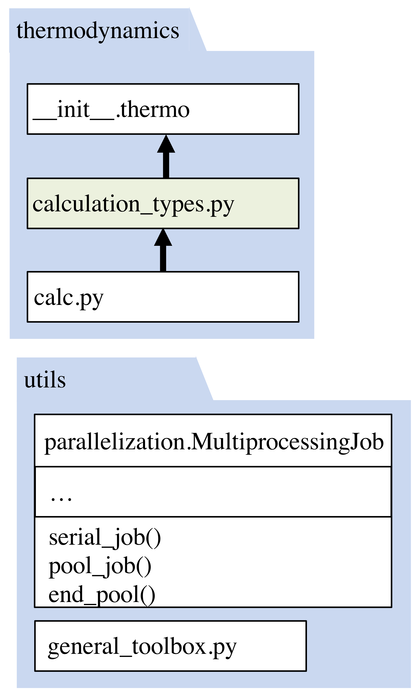

Additional Thermodynamic Calculations and Utilities
=========================================================

Thermodynamic property evaluation, using a supported calculation type, involves two aspects. The first aspect is parallelization using our custom utility class. Implementing python’s multiprocessing module requires a sub-wrapper for a single set of thermodynamic system conditions. Thus, a sub-wrapper handles the second aspect, execution of property evaluation. This function is expected to be short, referencing one to three thermodynamic functions. For example, in the :func:`~despasito.thermodynamics.calculation_types.solubility_parameter` calculation, the density of the system is computed and then used as an input to compute the Hildebrand solubility parameter. These two thermodynamic functions are found in the ``calc.py`` library. This file structure allows the thermodynamics to be compartmentalized in the ``calc.py`` module, while data checks, organization, and dispatch are handled by the calculation wrappers that are found and called by the higher level :func:`~despasito.thermodynamics.thermo` function.

To add a calculation type that is accessible to the thermo function, a contributor would add a new calculation type and, optionally, functions in the ``calc.py`` library. The new calculation type would be accompanied by a sub-wrapper that holds the thermodynamic calculations to allow for parallelization. An underscore should precede the sub-wrapper to signal that the ``thermo`` function should ignore it in searching for the proper calculation type. For example:

.. code-block:: python

    def solubility_parameter(Eos, **sys_dict):
        ...
        rhol, flagl, delta = MultiprocessingObject.pool_job(
                _solubility_parameter_wrapper, inputs
            )
        ...
        return output_dict
    
    def _solubility_parameter_wrapper(args):
        ...
        rhol, flagl = calc.calc_liquid_density(P, T, xi, Eos, **opts)
        delta = calc.hildebrand_solubility(rhol, xi, T, Eos, **opts)
        ...
        return rhol, flagl, delta

    
*Figure 1: The* ``thermodynamics`` *module employs the* :func:`~despasito.thermodynamics.thermo` *function to handle setting up and dispatching calculations. Any function in the* ``calculation_types`` *module can be discovered through a factory pattern. This module then contains wrappers that assemble supporting thermodynamics calculations from the* ``calc`` *module. A* ``utils`` *directory contains a custom class for parallelization and general functions that are not specific to the syntax and structure of this package.*  
